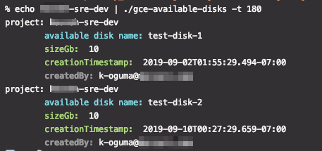

# gce-available-disks

This command is for searches of not being used/available disks in your GCP.
Like an aws command this.

`aws --region ap-northeast-1 ec2 describe-volumes --filters Name=status,Values=available`

- Use Cases
    - Stocktaking.
    - Cost controls.

## Requirements

- gcloud command (Google cloud SDK)
- Go
    - version is .go-version for goenv

## Preparation

```bash
gcloud beta auth application-default login
```

### If server daemon or others, it recommends with other authenticator, e.g. service account.

- https://cloud.google.com/docs/authentication/

### Install

```bash
make
```

## Usage

### Help

```bash
./gce-available-disks -h
```

```bash
% ./gce-available-disks example-sre-dev
project: example-sre-dev
        available disk name: test-disk-1
        sizeGb:  10
        creationTimestamp:  2019-09-02T01:55:29.494-07:00
project: example-sre-dev
        available disk name: test-disk-2
        sizeGb:  10
        creationTimestamp:  2019-09-10T00:27:29.659-07:00
```

- Add activity log
```bash
echo example-sre-dev | ./gce-available-disks -t 180
```

e.g.


### For example: At your all the projects

```
% gcloud projects list --sort-by=projectId --format="value(projectId)" | xargs -I% -P $(($(nproc) - 1)) ./gce-available-disks %
```

**If the above command fails, you can try the following command:**

e.g.
```
% for pj in $(gcloud projects list --sort-by=projectId --format="value(projectId)");do echo "===== $pj start. ====="; ./gce-available-disks -l -c -s $pj | grep -v 'project,available disk name,sizeGb,creationTimestamp,createdBy' 2>/dev/null ;done | tee ~/work/tmp/gcp-available.csv
```

Or not using `-l` option. See also the belows.

### Notice / Hint

- Activity logs sometimes can't be obtained it.
    - Hint
        - Silent option is available. `-s`
        - If not use `-l` option, it expects for high-speed responce.

## Contribution

### Test

```bash
PROJECT=${YOUR_GCP_PROJECT} go test [-race|-run] . [-tc|-tl|-ts]
```

For example,
```bash
PROJECT=example-sre-dev go test -race -run . -tc -tl -ts
# result
project,available disk name,sizeGb,creationTimestamp,createdBy
example-sre-dev,test-disk-1,10,2019-09-02T01:55:29.494-07:00,k-oguma@example.com
example-sre-dev,test-disk-1,10,2019-09-02T01:55:29.494-07:00,k-oguma@example.com
PASS
ok      github.com/k-oguma/gce-available-disks  16.136s
```
